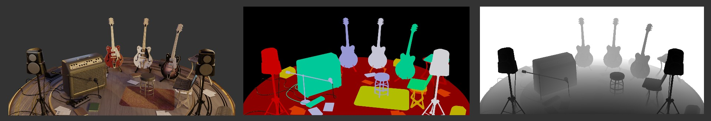
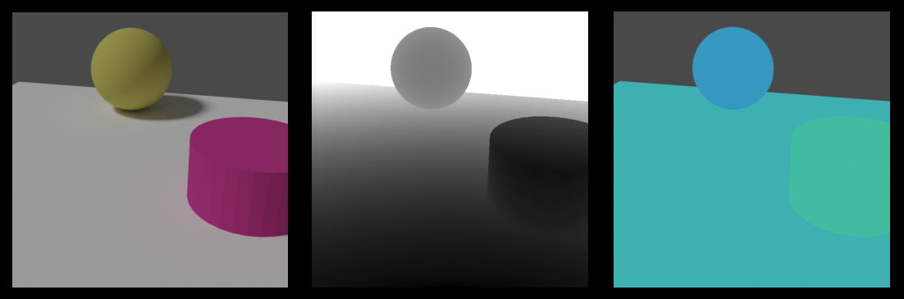
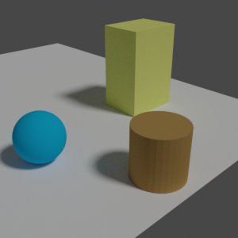
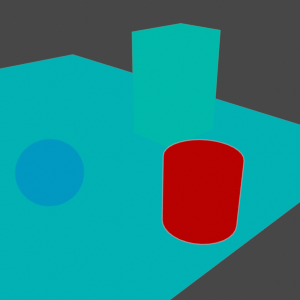
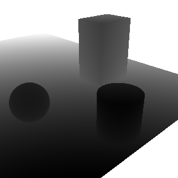
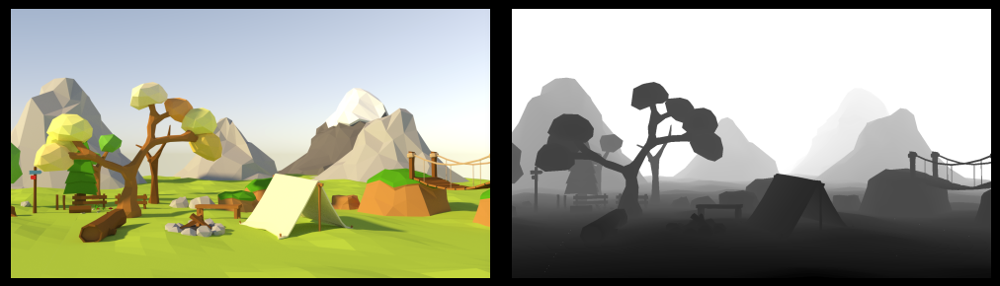

# Shapes3D

### Contents: [Features](#2-features) | [Install](#3-installation) | [Examples](#1-examples) | [Run](#4-run)

---




---

Shapes3D is an open sourced library to simplify the work flow with blender for Computer Vision problems. It has two main modules. The first is a minimalist API to simplify the interaction with blender (e.g. generate depth or instance segmentation maps with one function or configure blender's renderer). The second module is `worlds`, which implements simple 3D worlds for different use cases.

## Overview

#### Blender minimalist API

```python
# Load and set up your scene in Blender

import shapes3d as shps

shps.render.set_color()
shps.render.set_depth_map()
shps.render.set_instance_segmentation()

shps.render.render("/path", use_gpu=True)
```

**output:**


<p style="font-size:10px" align="center">scene taken from https://www.blendernation.com/2017/11/23/free-model-download-eevee-guitars-stage/.</p>

---

#### Worlds:

A very simple example similar to the environment used in [Neural scene representation and rendering (GQN)](https://deepmind.com/blog/article/neural-scene-representation-and-rendering):

```python
import shapes3d as shps

env = shps.worlds.SimpleWorld()
env.add_sphere()
env.add_cylinder()

env.render("/path") # Renders color image, depth map and instance segmentation
```

**output:**




## Table of contents

1. [Examples](#1-examples)
2. [Features](#2-features)
3. [Installation](#3-installation)
4. [Run](#4-run)
5. [Contribute](#5-contribute)


## 1. Examples

**World example:** A very simple example similar to the environment used in [Neural scene representation and rendering (GQN)](https://deepmind.com/blog/article/neural-scene-representation-and-rendering). To Run this experiments first check the install section. This code can be run directly inside blender or from a normal terminal.

```python
import shapes3d as shps
```

Create an environment

```python
# Create an environment and clean default shapes in blender
env = shps.worlds.SimpleWorld(use_gpu=True)
```

Set up the environment

```python
# Generate a sphere with random position dimensions and colors
env.add_sphere()

# Or specify the properties you want
env.add_cuboid(dims=(1.0, 1.3, 2.0))

# For properties such as location, dimensions or radius shapes3d
# also runs simple checks to avoid collisions
env.add_cylinder(dims=(1,3,4), color=(0.5, 0.3, 0.1))  
```

Render the environment

```python
# Configure intrinsic camera parameters
env.set_focal_length(40)

# Configure extrinsic camera parameters
env.render(camera_location=(7, -2, 3),
           camera_rotation=(63*math.pi/180, 0, 45*math.pi/180),
           folder_path="path/", 	# Output folder
           file_id=2) 				# Id of file
```

**Output files:**

|  |  |  |
| :----------------------------------------------------: | :-------------------------------------------------------: | :----------------------------------------------------: |
|                 `Image_color_0002.png`                 |                 `Image_inst_seg_0002.png`                 |                 `Image_depth_0002.png`                 |

---


**API example:** An example of how to use the API

```python
import shapes3d as shps	
```

Set up your scene in blender. You can combine shapes3d functions with blender manual configuration or `bpy`, it is totally compatible.

```python
shps.camera.set_fov(math.pi) # Set the field of view of the camera
shps.scene.set_light() 		 # Create a Sun
```

Configure the renderer

```python
# Change resolution of the rendered image
shps.render.set_image_resolution(600,600)

# Set the render parameters confortably in only one function
shps.render.set_render_config(gpu=True, render='Cycles', samples=256)
```

Render and generate output files

```python
# Get camera parameters
intrinsic = shps.camera.get_intrinsic_parameters()
extrinsic = shps.camera.get_extrinsic_parameters()

# Activate depth map as well as normalized .png depth map
shps.render.set_depth_map(png=True)
shps.render.set_color() # As well as color image

# Render and save the files
shps.render.render("/path")
```

**output:**



<p style="font-size:10px" align="center">scene taken from https://www.blendernation.com/2017/12/03/20-000-subscribers-free-low-poly-assets/</p>

---

For more examples see the examples folder.


## 2. Features

This is a partial list of the features available. **This project is in development so the list is incomplete and new features could be added every day**.

| Module         | Functions / Classes                                          | Description                                                  |
| -------------- | ------------------------------------------------------------ | ------------------------------------------------------------ |
| `shps.worlds`  | `SimpleWorld`                                                | Implements, simple radius-based collision checking, domain randomization, Tracking object plus simple configuration. |
| `shps.render`  | `set_color`<br />`set_instance_segmentation`<br />`set_depth_map`<br />`set_image_resolution`<br />`set_render_configuration`,`render`<br />`set_scene_into_instance_segmentation` | Implements useful functionalities for computer vision, as well as groupings common functions used in blender repetitively regarding rendering. |
| `shps.camera`  | `get_intrinsic_parameters`<br />`get_extrinsic_parameters`<br />`set_rotation`, `set_location`<br />`set_far`, `set_near`<br />`set_focal_lenght`, `set_fov` | Deals with functions in blender regarding the camera object. |
| `shps.scene`   | `set_light`, `get_light`<br />`clean_scene`<br />`close_scene` | Deals with generic behaviours regarding the scene properties and elements. |
| `shsps.shapes` | `Sphere`,  `Cuboid`,  `Cylinder`, `Capsule`                  | Implements simple classes to add geometric 3D shapes into blender scene conveniently. |


## 3. Installation

The recommended installation is using conda. Blender comes with its own python, therefore we will replace the python folder for a conda environment. Shapes3D has only been tested on **Blender 2.82** we recommend you work with that or higher version.

0. To begin with, you should get blender ready (you can download it [here](https://www.blender.org/)). Check what version of python that version of blender is using. To quickly check check in ubuntu, check `[blender folder]/2.82/_python/bin/` there should be a file called, for example, `python3.7m`, that means blender is using python 3.7. From now on use that version of python

1. Create the conda environment with `conda create --name blender python=3.7` and activate it `conda activate blender`.
2. Clone this repository with `clone https://github.com/kopernikusai/shapes3d.git`.
3. `cd shapes3d`.
4. Install shapes3d in the conda repository with `pip install -e .`

You have installed shapes3d in a conda environment. Now we need to start using that environment by default in blender. We recommend before continuing, moving blender to a more common path such as `/` or `C:/Program_files`.

5. While in the conda environment, run `which python` in the terminal to get the path of the conda environment. You should get something like `/somepath/miniconda3/envs/blender/bin/python`. Ignore the last part (`/bin/python`), we will use the rest.
6. Rename python folder inside blender, for example `mv [blender_path]/[blender_version]/python [blender_path]/[blender_version]/_python`.
7. Create a symbolic link of the conda folder (from step 5. please ignore `/bin/python/` as said in step 5) inside blender (from step 6) with `ln -s /somepath/miniconda3/envs/blender/ [blender_path]/[blender_version]/python`.

You now have a conda environment as the default python environment in blender. So far you can use the new environment from blender's console. But iin order to run blender from the terminal, we have to add blender to the environment variable PATH.

Adding blender to PATH is simple, 

8. run `export PATH="[blender_path]:$PATH"` every time you want to run blender from terminal or you can add `export PATH="[blender_path]:$PATH"` at the end of `~/.bashrc`, `~/.zshrc` or `~/.profile` depending on your configuration to export blender automatically every time you open a terminal.


## 4. Run

There are two ways of running shapes3d. Using blender's console or using terminal directly. The quickest way is using blender's integrated console.

#### Run using blender's console

Open Blender and go to the 'Scripting' tab located on top. Import shapes3d as shps and start developing

#### Run using terminal

After adding blender to the path you will be able to run blender from terminal by typing `blender`. To run a python script use the flag `--python [path/to/file]`. In order to avoid launching the GUI use the flat `--background`. And for more information run `blender --help`.

```
blender --background --python examples/basic_world.py
```


## 5. Contribute

We are open to contributors and ideas. If you want to help or share ideas, we invite you to open a new issue, we welcome all contributions.


:v:


